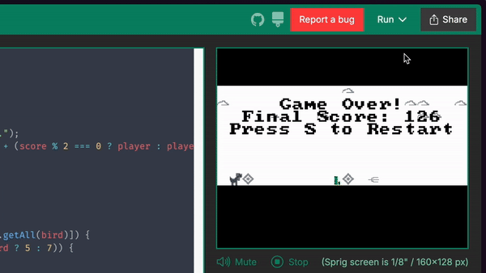

# Better Dino

## Overview
"Better Dino" is an endless runner game inspired by the classic Chrome Dino game. The player controls a character that must jump over obstacles and collect power-ups while the speed of the game increases over time. The objective is to achieve the highest score possible before colliding with an obstacle.

## Features
- Endless gameplay with increasing difficulty.
- Randomly generated clouds and obstacles.
- Power-ups that enhance gameplay.
- High score tracking to encourage competitive play.

## Gameplay Mechanics
- The game starts with a player character (the Dino) positioned on the ground.
- The player can jump to avoid obstacles such as cacti and birds.
- As the score increases, the speed of the game ramps up, making it progressively harder.
- Power-ups occasionally appear, granting temporary advantages.

## Controls
- **Jump**: Press the `W` key to make the Dino jump.
- **Restart**: Press the `S` key to restart the game after a game over.

## Game Loop
1. The game initializes the game map with layers representing the sky, ground, and obstacles.
2. The player starts at the initial speed, and the game speed increases every 10 points scored.
3. Clouds are generated randomly in the air layers.
4. The player can jump to avoid obstacles that spawn at the ground level.
5. If the player collides with an obstacle, the game ends, and the final score is displayed.
6. The player can restart the game by pressing the `S` key.

## Installation
To play "Better Dino," copy the code from better-dino.js and load it on your sprig!

## Contributing
Contributions are welcome! If you have ideas for new features or improvements, feel free to create a pull request or open an issue.

## License
This project is open-source and available under the [MIT License](LICENSE).
